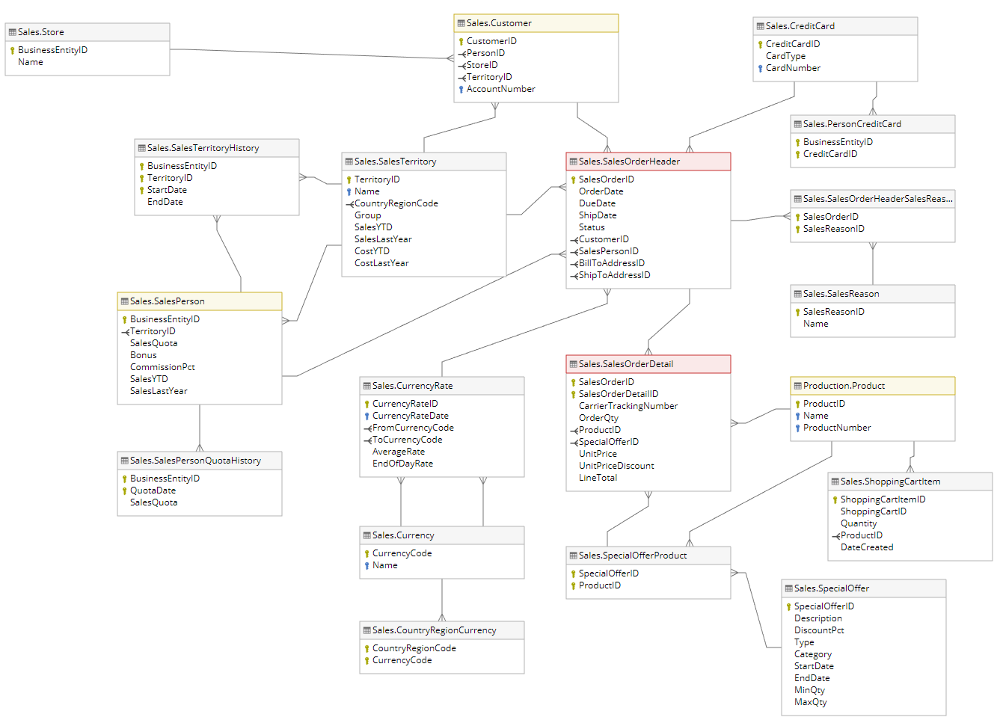

# [Applying Business Intelligence Technology And Automation Processes To Make More Accurate Decisions For Sales Operations](https://github.com/trannhatnguyen2/K20406C_BoKho)

## Member of group

### **`BoKho`**

| student_id | class   | full_name              | role   |
| ---------- | ------- | ---------------------- | ------ |
| K204061440 | K20406T | Tran Nhat Nguyen       | Leader |
| K204061446 | K20406C | Man Dac Sang           | Member |
| K204061411 | K20406T | Nguyen Thai Ngoc Suong | Member |
| K204060310 | K20406C | Thai Thien Truc        | Member |

# 📕 Table of contents

<!--ts-->

- 🛠️ [Requirements](#️-requirements)
- 🧙‍♂️ [Data Source](#-data-source)
- 🚀 [Solution](#-solution)
- 🧱 [Building Data Warehouse](#-building-data-warehouse)
- 📊 [Result](#️-result)
- 📂 [Files](#-files)
<!--te-->

  

# 🛠️ Requirements

# 🧙‍♂️ Data Source

AdventureWorks Database is a sample online transaction processing (OLTP) database provided by Microsoft. The AdventureWorks Database supports a multinational manufacturing company called Adventure Works Cycles. This project will utilize the AdventureWorks Database version 2019 and concentrates on module Sales only.

    Data Source: Sales Module

# 🚀 Solution

    BI Solution

- Step 1: Load data from On-Premise and On-Cloud into SQL Server Integration Services (SSIS) tool via Ingest Phase
- Step 2: ETL data into the Staging Area with the schema name "Integration", and set up job scheduler to automatically run the package once every hour
- Step 3: ETL data into Data Warehouse with the schema name "DW", and run the package automatically once a day. At the same time, Truncate all data from the Staging Area every month.
- Step 4: divide 2 branches:

> Using Power Automate to automatically refresh data and perform analysis report generation once a day.

> Using SQL Server Analysis Services (SSAS) tool to create cube for analysis

# 🧱 Building Data Warehouse

`Bus Matrix`, `Master Data`, `Transaction Data`, `ETL Mapping`, etc. are deployed to support the data warehouse construction process.

## Data Warehouse model

The diagram below illustrates the fundamental conceptual diagram of the proposed data warehouse in Star format.

    Data Warehouse Star Schema

## ETL process

### **ETL Master Pipeline**

    ETL Master Pipeline

Based on the pipeline shown above, it is divided into 3 phases:

- Phase 1: Load data from Source --> Staging Area
- Phase 2: Load data from Staging --> Dimension Tables
- Phase 3: Load data from Staging -- Fact Table

### **Phase 1: Staging Area's ETL Process**

    Load data from Source --> Staging Area

### **Phase 2: Dimension Table's ETL Process**

    Load data from Staging --> Dimension Tables

### **Phase 3: Fact Table's ETL Process**

    Load data from Staging -- Fact Table

### **Truncate Tables in Staging Area**

    Truncate Tables in Staging Area

### **Job Scheduler**

    Schedule jobs configure the step truncate

# 📊 Result

## Data Analytics with SSAS Technology

    Data Warehouse Schema (SSAS)

## Incremental Refresh Using Power Automate

    The Flow of automated refresh a dataset

## Data analysis with Power BI

### Sales Performance

    Sales Performance Dashboard

### Product Analysis

    Product Analysis Dashboard

### Delivery Performance

    Delivery Performance Dashboard

### Customer Segmentation

    Customer Segmentation Dashboard

# 📂 Files

### > **1. Report (both Word and pdf file) -** [Link](https://github.com/trannhatnguyen2/K20406C_BoKho/blob/main/K20406C_BoKho.pdf)

### > **2. Slide -** [Link](https://github.com/trannhatnguyen2/K20406C_BoKho/blob/main/Slide_K20406C_BoKho.pdf)

### > **3. SSIS and SSAS package -** [Link](https://github.com/trannhatnguyen2/K20406C_BoKho/tree/main/DW_K20406C_BoKho)

### > **4. SQL file query -** [Link](https://github.com/trannhatnguyen2/K20406C_BoKho/tree/main/SQL_Query)

### > **5. Power BI file (include 4 Dashboard) -** [Link](https://github.com/trannhatnguyen2/K20406C_BoKho/blob/main/Dashboard_BoKho.pbix)

---

## ⚠️ Warning

- You must open the empty Power BI file first and then `Ctrl + O` to open the **Dashboard_BoKho.pbix** file to display the map chart.
- If you still can't open, please see the instructions at: [View solution](https://community.powerbi.com/t5/Service/Enable-Map-Visual/td-p/2187937)

---

&copy; 2023 BoKho

